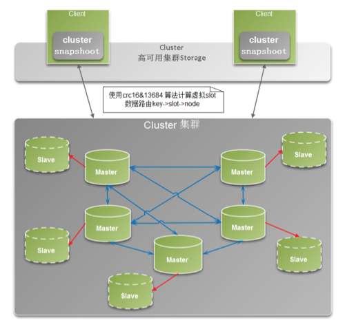

# Redis负载均衡(一主二从、主从复制、读写分离)

场景引入：
		单台服务器部署，服务器出现意外宕机了，服务器就提供不了服务了。所以需要集群部署。假如部署了三台服务器，一主二从，主服务器挂掉，从服务器起来担任主服务器的任务。从服务器是为了主服务器宕机后防灾的。主服务器的数据不能丢，所以他们的数据是同步的，相同的。一般主服务器负责写，那么从服务器除了同步数据外比较清闲，所以设置它为读服务器，这就是读写分离。这就是集群部署，主从复制，读写分离。集群保证的是高并发。



## 一、环境搭建

1. 环境准备

    **系统环境**
    
    | 作用     | IP地址              | 端口     | 系统版本     | redis版本    |
    | -------- | ------------------- | -------- | ------------ | ------------ |
    | **主库** | **192.168.199.137** | **6379** | **Cenos7.2** | **Redis7.6** |
    | **从一** | **192.168.199.138** | **6379** | **Cenos7.2** | **Redis7.6** |
| **从二** | **192.168.199.139** | **6379** | **Cenos7.2** | **Redis7.6** |
	
	注意： Redis一主二从主要是用于读写分离和容灾，配置是配从不配主，主从复制首次同步是	全量，后面是增量同  步；但是只要是重新连接master,一次完全同步（全量复制)将被自动执行。 
	
2. redis安装，和单机安装没有差别，主要区别在于配置。安装参看章节[redis环境搭建](./redis环境搭建.md)

3. redis.conf配置文件配置

    主库 192.168.199.137 redis.conf 配置

    ```
    # 修改如下key的值
    bind 0.0.0.0   #任意ip都可以连接
    protected-mode no	#关闭保护，允许非本地连接
    port 6379	#端口号
    daemonize yes	#后台运行
    pidfile /var/run/redis_6379.pid	#进程守护文件，就是存放该进程号相关信息的地方
    dir /usr/local/zmf/redis-5.0.7/6379/	#db等相关目录位置
    appendonly yes	#开启日志形式
    ```

    从库一  192.168.199.138 redis.conf 配置

    ```
    # 修改如下key的值
    bind 0.0.0.0   #任意ip都可以连接
    protected-mode no	#关闭保护，允许非本地连接
    port 6379	#端口号
    daemonize yes	#后台运行
    pidfile /var/run/redis_6379.pid	#进程守护文件，就是存放该进程号相关信息的地方
    dir /usr/local/zmf/redis-5.0.7/6379/	#db等相关目录位置
    slaveof 192.168.199.137 6379	#主信息
    masterauth 123456   --主库的密码（本机可以不配置)
    appendonly yes	#开启日志形式
    ```

    从库二  192.168.199.138 redis.conf 配置

    ```
    # 修改如下key的值
    bind 0.0.0.0   #任意ip都可以连接
    protected-mode no	#关闭保护，允许非本地连接
    port 6379	#端口号
    daemonize yes	#后台运行
    pidfile /var/run/redis_6379.pid	#进程守护文件，就是存放该进程号相关信息的地方
    dir /usr/local/zmf/redis-5.0.7/6379/	#db等相关目录位置
    slaveof 192.168.199.137 6379	#主信息
    masterauth 123456   --主库的密码（本机可以不配置)
    appendonly yes	#开启日志形式
    ```

4. 启动redis集群

   ```
   [root@localhost redis-5.0.7]# cd src/
   [root@localhost src]# ./redis-server /usr/local/zmf/redis-5.0.7/redis.conf
   # 进入redis客户端，查看sentinel信息
   [root@localhost src]# ./redis-cli -h 192.168.199.137 -p 6379
   > info replication
   ```

5. 测试

   ```
   # 在主库上访问redis-cli,设置一个值
   　/usr/local/redis/src/redis-cli -p 6379 --raw
   　> set name '丁洁'
   　> get name
   # 在从库上访问redis-cli,查看值是否同步过来了
     /usr/local/redis/src/redis-cli -p 6379 --raw
     > get name
   ```

   **为了便于管理，编写统一的启动、停止、服务脚本**

1. 启动start.sh脚本

   ```
   #!/bin/sh
   /usr/local/zmf/redis-5.0.7/src/redis-server /usr/local/zmf/redis-5.0.7/redis.conf
   /usr/local/zmf/redis-5.0.7/src/redis-server /usr/local/zmf/redis-5.0.7/redis.conf
   /usr/local/zmf/redis-5.0.7/src/redis-server /usr/local/zmf/redis-5.0.7/redis.conf
   ```

2. 停止stop.sh脚本

    ```
    #!/bin/sh
    /usr/local/zmf/redis-5.0.7/src/redis-cli -p 6379 shutdown
    /usr/local/zmf/redis-5.0.7/src/redis-cli -p 6379 shutdown
    /usr/local/zmf/redis-5.0.7/src/redis-cli -p 6379 shutdown
    ```

3. 编写restart.sh脚本

    ```
#!/bin/sh
    systemctl stop redis-cluster
    systemctl start redis-cluster
    ```

9. 编写为开机服务

   ```
   [root@localhost src]# cd /usr/lib/systemd/system/
   [root@localhost system]# nano redis-cluster.service
       [Unit]
       Description=redis-cluster
       After=network.target remote-fs.target nss-lookup.target
       [Service]
       Type=forking
       ExecStart=/usr/local/zmf/script/start.sh
       ExecStop=/usr/local/zmf/script/stop.sh
       ExecReload=/usr/local/zmf/restart.sh
       [Install]
       WantedBy=multi-user.target　
   # 改变权限
   [root@localhost system]# chmod 777 redis-cluster.service
   # 进程服务重加载
   [root@localhost system]# systemctl daemon-reload
   ```

10. 其他常用命令

    ```
    # 开机启动主从
    [root@localhost system]# systemctl enable redis-cluster.service
    # 启动主从
    [root@localhost system]# systemctl start redis-cluster.service
    # 关闭主从
    [root@localhost system]# systemctl stop redis-cluster.service
    # 重启主从
    [root@localhost system]# systemctl restart redis-cluster.service
    ```

    