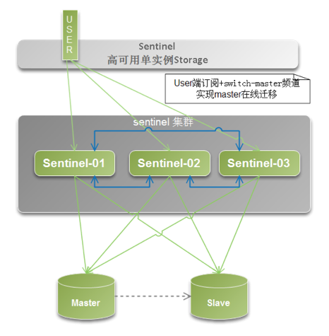

# Redis高可用(哨兵模式)

场景引入：
	如果主服务器挂了，我们是不知道是否挂了，什么时候挂的，这个时候就需要哨兵了，哨兵会按照一定频率脉冲似的不停地去检查每台服务器的心跳，如果哨兵发现主服务器挂了，他就会启用某一台从服务器做主服务器。这个时候就实现了redis的高可用。哨兵保证的是HA，保证特殊情况故障自动切换，哨兵盯着你的“redis主从集群”。



## 一、环境搭建

1. 环境准备

   **系统环境**

   | 作用                 | IP地址              | 端口号   | 系统版本     | redis版本    | 哨兵文件          |
   | -------- | ------------------- | -------- | ------------ | ------------ |------------ |
   | **主库**、**哨兵一** | **192.168.199.137** | **6379** | **Cenos7.2** | **Redis7.6** |**Sentinel.conf**|
   | **从一**、**哨兵二** | **192.168.199.138** | **6379** | **Cenos7.2** | **Redis7.6** |**Sentinel.conf**|
   | **从二**、**哨兵三** | **192.168.199.139** | **6379** | **Cenos7.2** | **Redis7.6** |**Sentinel.conf**|
   
   **注意：除了监控各个redis服务器之外，哨兵之间也会相互监控**
   
2. redis集群搭建一主二从，参看章节[redis负载均衡搭建](./redis负载均衡.md)

3. 配置哨兵模式 sentinel.conf

   192.168.199.137 哨兵一 sentinel.conf

   ```
   port 26379 #端口号
   daemonize yes #后台运行
   dir /usr/local/zmf/redis-5.0.7/sentinel/26379/tmp #解除挂载信息目录
   sentinel monitor mymaster 192.168.199.137  6379 2
   sentinel auth-pass mymaster 123456   #master如果设置密码 没有可以不用这一行
   sentinel down-after-milliseconds mymaster 5000  #修改心跳为5000毫秒
   protected-mode no    --关闭保护进程模式，防止哨兵不能互相通信
   sentinel parallel-syncs mymaster 1 #每次最多可以有1个从同步主。一个从同步结束，另一个从开始同步。
   sentinel failover-timeout mymaster 18000 #主从切换超时时间
   ```

   192.168.199.138 哨兵二  sentinel.conf

   ```
   port 26379 #端口号
   daemonize yes #后台运行
   dir /usr/local/zmf/redis-5.0.7/sentinel/26379/tmp #解除挂载信息目录
   sentinel monitor mymaster 192.168.199.137  6379 2
   sentinel auth-pass mymaster 123456   #master如果设置密码 没有可以不用这一行
   sentinel down-after-milliseconds mymaster 5000  #修改心跳为5000毫秒
   protected-mode no    --关闭保护进程模式，防止哨兵不能互相通信
   sentinel parallel-syncs mymaster 1 #每次最多可以有1个从同步主。一个从同步结束，另一个从开始同步。
   sentinel failover-timeout mymaster 18000 #主从切换超时时间
   ```

   192.168.199.139 哨兵三  sentinel.conf

   ```
   port 26379 #端口号
   daemonize yes #后台运行
   dir /usr/local/zmf/redis-5.0.7/sentinel/26379/tmp #解除挂载信息目录
   sentinel monitor mymaster 192.168.199.137 6379 2
   sentinel auth-pass mymaster 123456   #master如果设置密码 没有可以不用这一行
   sentinel down-after-milliseconds mymaster 5000  #修改心跳为5000毫秒
   protected-mode no    --关闭保护进程模式，防止哨兵不能互相通信
   sentinel parallel-syncs mymaster 1 #每次最多可以有1个从同步主。一个从同步结束，另一个从开始同步。
   sentinel failover-timeout mymaster 18000 #主从切换超时时间
   ```

4. 先启动redis集群

5. 启动哨兵

   ```
   [root@localhost redis-5.0.7]#  cd src/
   [root@localhost src]#  ./redis-sentinel  /usr/local/zmf/redis-5.0.7/sentinel.conf 
   # 进入redis客户端，查看sentinel信息
   [root@localhost src]# ./redis-cli -h 192.168.199.137 -p 26379
   > info sentinel
   ```

6. 测试

   - 主137停掉后变成从，原有的两个从，有一个升级为主

   - 137再次启动后，依然是从

##  二 、哨兵开机启动

1. 创建sh脚本目录

   ```
   [root@localhost redis-5.0.7]# mkdir  /usr/local/zmf/sentinel/script
   [root@localhost redis-5.0.7]# cd  /usr/local/zmf/sentinel/script
   ```

2. 编写start.sh脚本

   ```
   #!/bin/sh
   /usr/local/zmf/redis-5.0.7/src/redis-sentinel   /usr/local/zmf/redis-5.0.7/sentinel.conf
   /usr/local/zmf/redis-5.0.7/src/redis-sentinel   /usr/local/zmf/redis-5.0.7/sentinel.conf
   ```

3. 编写stop.sh脚本

   ```
   #!/bin/sh
   /usr/local/zmf/redis-5.0.7/src/redis-cli -p 26001 shutdown
   /usr/local/zmf/redis-5.0.7/src/redis-cli -p 26001 shutdown
   /usr/local/zmf/redis-5.0.7/src/redis-cli -p 26001 shutdown
   ```

4. 编写restart.sh脚本

   ```
   #!/bin/sh
   systemctl stop redis-sentinel
   systemctl start redis-sentinel
   ```

5. 编写redis-sentinel.service

   ```
   [root@localhost src]# cd /usr/lib/systemd/system/
   [root@localhost system]# nano redis-sentinel.service
       [Unit]
   	Description=redis-sentinel
   	After=redis-cluster.service
   	[Service]
   	Type=forking
   	ExecStart=/usr/local/zmf/sentinel/script/start.sh
   	ExecStop=/usr/local/zmf/sentinel/script/stop.sh
   	ExecReload=/usr/local/zmf/sentinel/script/restart.sh
   	[Install]
   	WantedBy=multi-user.target　
   # 改变权限
   [root@localhost system]# chmod 777 redis-sentinel.service
   # 进程服务重加载
   [root@localhost system]# systemctl daemon-reload
   ```

6. 其他常用命令

   ```
   # 开机启动主从
   [root@localhost system]# systemctl enable redis-sentinel.service
   # 启动主从
   [root@localhost system]# systemctl start redis-sentinel.service
   # 关闭主从
   [root@localhost system]# systemctl stop redis-sentinel.service
   # 重启主从
   [root@localhost system]# systemctl restart redis-sentinel.service
   ```

   

